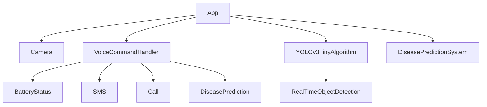

# 👁️ Be My Eyes – Android App for the Visually Impaired

[](https://developer.android.com/)
[](https://copyright.gov.in/)
[](https://kotlinlang.org/)

> A real-time object detection and voice-assistance Android application developed to empower blind and visually impaired individuals.

---

## 📱 Overview

**Be My Eyes** is an assistive Android application designed to help visually impaired users interact with their environment using real-time video processing and voice commands. By integrating AI models and voice interfaces, the app offers object detection, disease prediction, and basic smartphone utilities—accessible via simple voice commands.

---

## 🎯 Key Features

- 🔍 **Real-Time Object Detection** using YOLOv3-tiny
- 🧠 **AI-based Disease Prediction**
- 🗣️ **Voice Command Capabilities**
  - Check battery status
  - Show date and time
  - Send and receive SMS
  - Make calls
- 🔊 **Text-to-Speech Conversion**
- 🎮 **Simple, Accessible UI for Blind Users**

---

## 🏗️ System Architecture



---

## 🧪 Tech Stack

| Component       | Technology     |
|----------------|----------------|
| IDE            | Android Studio |
| Frontend       | XML            |
| Backend        | Kotlin         |
| AI Framework   | YOLOv3-tiny    |
| Voice Interface| Text-to-Speech / Speech-to-Text APIs |

---

## 🛠️ Installation

1. Clone the repository:

   ```bash
   git clone https://github.com/yourusername/be-my-eyes-app.git
   cd be-my-eyes-app
   ```

2. Open in **Android Studio**.

3. Connect your Android device or emulator.

4. Build and run the app.

---

## 🧠 How It Works

- The app launches the camera automatically on startup.
- Press the **Up button** to start object detection (YOLOv3-tiny).
- Press the **Down button** to activate voice commands.
- Press the **Back button** to stop all services.
- The app outputs audio feedback based on voice commands and detection.

---

## 📂 Class Structure (Simplified)

```plaintext
BeMyEyesApplication
├── Camera
│   ├── startCaptureVideo()
│   └── stopCaptureVideo()
├── YOLOv3TinyAlgorithm
│   ├── startDetection()
│   ├── stopDetection()
│   └── processFrame()
├── DiseasePredictionSystem
│   └── predictDisease()
└── VoiceCommandHandler
    ├── checkBatteryStatus()
    ├── showDateTime()
    ├── sendSms()
    ├── makeCall()
    └── convertVoiceToText()
```

---

## 📚 Research & Publications

- 📄 *"Be My Eyes App for Blind People"* – Literary/Dramatic Work
  - Registered under **Copyright Office, India**
  - **Registration Number:** `L-144557/2024`
  - **Diary Number:** `2252/2024-CO/L`
  - **Application Date:** 19/01/2024
  - **Author & Owner:** Dr. Pravin Latane

> This work is unpublished and protected under Indian Copyright Law. All rights reserved to the author and co-creators. Commercial reproduction, redistribution, or derivative creation is prohibited without explicit permission.

---

## 👩‍💻 Contributors

- 🎓 **Ms. Bankar Arti Kalyan** – BEIT52  
- 🎓 **Mr. Ahire Suyog Suresh** – BEIT51  
- 🎓 **Ms. Wadekar Niyati Pandharinath** – BEIT27  
- 🎓 **Ms. Ghodkhinde Monika Atmaram** – BEIT44  

👨‍🏫 **Guided by:** Dr. P. C. Latane  
*Department of Information Technology, Sinhgad Institute of Technology, Lonavala*

---

## 📄 License

This project is protected by a **registered copyright** under the Copyright Act of India (1957).

---

## 🙌 Acknowledgments

Special thanks to:
- YOLOv3 and open-source contributors
- Android accessibility community
- All research paper authors cited in our literature survey

---

## 🔗 Related Projects

- [Be My Eyes (Official)](https://www.bemyeyes.com/)
- [Assistive Tech for the Blind](https://github.com/topics/assistive-technology)

---

## 💬 Feedback & Contact

We welcome suggestions and collaborations. Please [open an issue](https://github.com/yourusername/be-my-eyes-app/issues) or email the project guide for inquiries.
